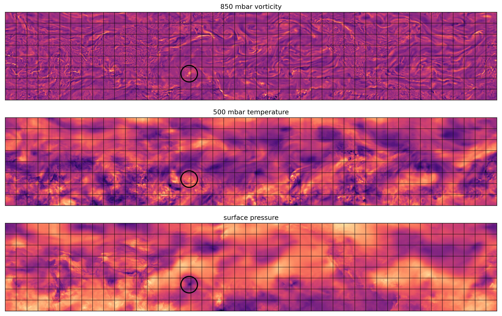

# Cyclone Tracking

This project combines the historical record of real cyclones with data-assimilated global weather model output (reanalysis) to train a deep convolutional network capable of detecting cyclones in simulated climates. See the [**testing notebook**](test_cyclone_detector.ipynb) for more explanation and demonstration code.

I would be happy to share the full dataset, which is standardized and stored convieniently in [`zarr`](https://zarr.readthedocs.io/en/stable/) format (inputs and targets) on Google Cloud Storage.

Final model training hasn't happened yet because I ran out of GCP free credits doing other stuff and I'd like to avoid spending a bunch of money for time on the bigger GPUs.

### Data Sources

* ERA5 reanalysis
	* vorticity and temperature are downloaded on [pressure levels](https://cds.climate.copernicus.eu/cdsapp#!/dataset/reanalysis-era5-pressure-levels?tab=overview)
	* surface pressure is downloaded on a [single level](https://cds.climate.copernicus.eu/cdsapp#!/dataset/reanalysis-era5-single-levels?tab=overview)
	* the climate data store API ([cdsapi](https://cds.climate.copernicus.eu/api-how-to)) was used to download files directly to Google Cloud Storage
* Storm Tracks
	* provided by [NOAA NCEI](https://www.ncei.noaa.gov/products/international-best-track-archive) under the description: International Best Track Archive for Climate Stewardship (IBTrACS)
	* [technical details](refs/IBTrACS_version4_Technical_Details.pdf) and [column documentation](refs/IBTrACS_v04_column_documentation.pdf) are included in this repo for reference
